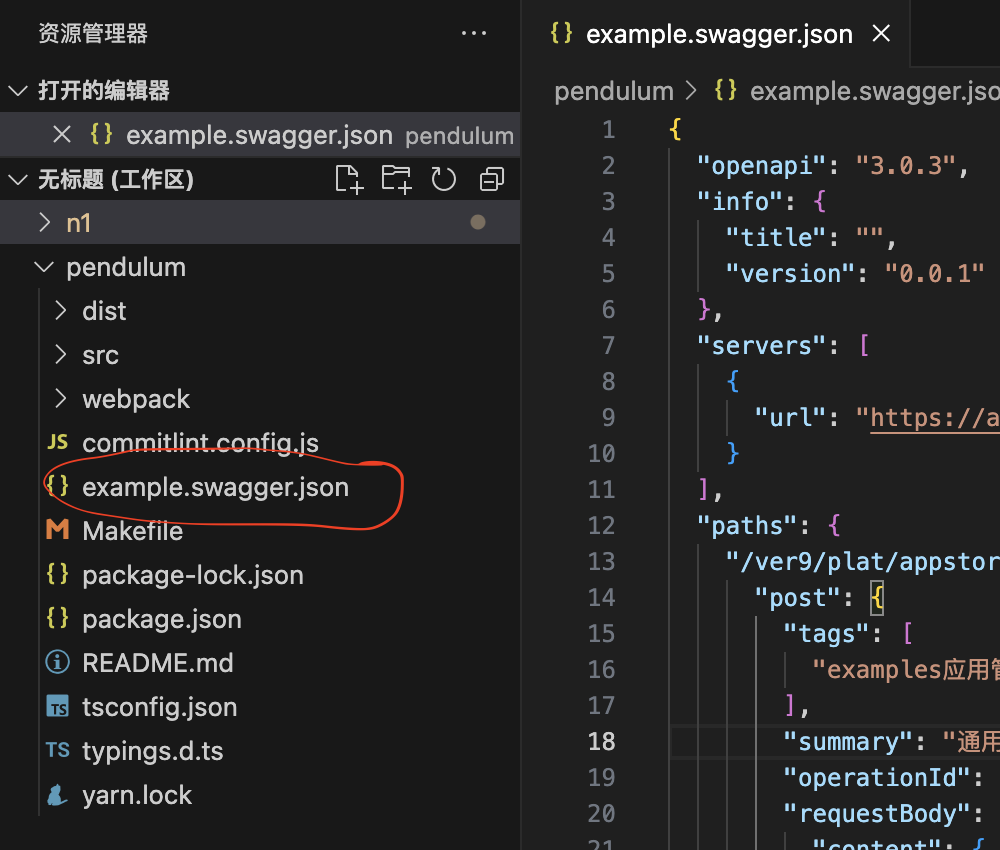

# Paimon
根据V3版本swagger.json文件自动生成Typescript接口代码
## 用法
1. 将openAPI json文件放入工程内，必须以`.swagger.json`或者`.api.json`结尾

2. 输入`//$`并紧跟接口地址触发提示

## 声明
* 解析openAPI JSON并将其转化成typescript openAPI代码的部分从 [https://github.com/ferdikoomen/openapi-typescript-codegen](https://github.com/ferdikoomen/openapi-typescript-codegen) 拷贝，感谢
* the code that used to parse openAPI JSON file and compile it to typescript code is forked from  [https://github.com/ferdikoomen/openapi-typescript-codegen](https://github.com/ferdikoomen/openapi-typescript-codegen), thanks for its great works
